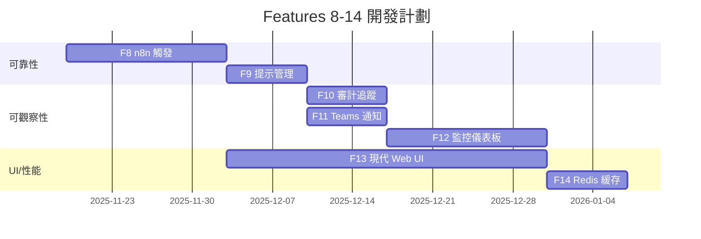

# PRD 附錄 B: Features 8-14 詳細規範

**版本**: 1.0  
**日期**: 2025-11-19  
**狀態**: 草稿

---

## 📑 文檔導航

- [PRD 主文檔](./prd-main.md)
- [PRD 附錄 A: Features 1-7](./prd-appendix-a-features-1-7.md)
- **[PRD 附錄 B: Features 8-14](./prd-appendix-b-features-8-14.md)** ← 您在這裡
- [PRD 附錄 C: API 規範](./prd-appendix-c-api-specs.md)

---

## 目錄

- [F8. n8n 觸發與錯誤處理](#f8)
- [F9. 提示管理（YAML 模板）](#f9)
- [F10. 審計追蹤（追加式日誌）](#f10)
- [F11. Teams 通知](#f11)
- [F12. 監控儀表板](#f12)
- [F13. 現代 Web UI](#f13)
- [F14. Redis 緩存](#f14)

---

## 附錄 B 概述

本附錄包含 **Features 8-14** 的詳細技術規範，涵蓋平台的**可靠性、可觀察性、UI/UX 和性能**層。這些功能是生產環境部署的基礎設施，確保系統穩定、可監控且高性能。

### 功能分類

| 類別 | 功能 | 優先級 | 開發時間 | 文檔鏈接 |
|------|------|--------|----------|----------|
| **可靠性** | F8. n8n 觸發與錯誤處理 | P0 | 2 週 | [📄 詳細規範](./features/appendix-b/feature-8-n8n-triggering.md) |
| **可靠性** | F9. 提示管理（YAML 模板）| P0 | 1 週 | [📄 詳細規範](./features/appendix-b/feature-9-prompt-management.md) |
| **可觀察性** | F10. 審計追蹤 | P0 | 1 週 | [📄 詳細規範](./features/appendix-b/feature-10-audit-trail.md) |
| **可觀察性** | F11. Teams 通知 | P0 | 1 週 | [📄 詳細規範](./features/appendix-b/feature-11-teams-notification.md) |
| **可觀察性** | F12. 監控儀表板 | P0 | 2 週 | [📄 詳細規範](./features/appendix-b/feature-12-monitoring-dashboard.md) |
| **UI/UX** | F13. 現代 Web UI | P0 | 4 週 | [📄 詳細規範](./features/appendix-b/feature-13-modern-web-ui.md) |
| **性能** | F14. Redis 緩存 | P0 | 1 週 | [📄 詳細規範](./features/appendix-b/feature-14-redis-caching.md) |

**總開發時間**: 12 週（原始） | **並行化後**: 6-7 週

### 與附錄 A 的關係

```
附錄 A (Features 1-7)          附錄 B (Features 8-14)
核心業務邏輯層                  基礎設施層
├─ F1-F3: 核心引擎       →     依賴 F8 觸發、F14 緩存
├─ F4-F5: 創新功能       →     依賴 F10 審計、F11 通知
└─ F6-F7: 開發者體驗     →     依賴 F13 UI、F12 監控
```

---

## <a id="f8"></a>F8. n8n 觸發與錯誤處理

**📄 [完整文檔](./features/appendix-b/feature-8-n8n-triggering.md)**

### 快速概覽

**分類**: 可靠性  
**優先級**: P0 (必須擁有 - 觸發機制)  
**開發時間**: 2 週  
**複雜度**: ⭐⭐⭐⭐ (高)

### 功能摘要

n8n 觸發與錯誤處理是平台的**事件驅動入口層**，提供：

- **定時觸發**（Cron）：按計劃執行工作流
- **事件觸發**（Webhook）：響應外部事件
- **智能重試**：指數退避策略避免雪崩
- **死信隊列**：失敗請求的手動干預機制

### 關鍵指標

- 觸發成功率: **≥99.5%**
- 自動重試成功率: **≥80%**
- 平均故障恢復時間: **<15 分鐘**

### 主要用戶故事

1. **US-F8-001**: 配置 Cron 定時觸發器（3 天）
2. **US-F8-002**: 配置 Webhook 事件觸發器（3 天）
3. **US-F8-003**: 智能錯誤處理與指數退避重試（4 天）
4. **US-F8-004**: 死信隊列（DLQ）與手動干預（3 天）

---

## <a id="f9"></a>F9. 提示管理（YAML 模板）

**📄 [完整文檔](./features/appendix-b/feature-9-prompt-management.md)**

### 快速概覽

**分類**: 可靠性  
**優先級**: P0 (必須擁有)  
**開發時間**: 1 週  
**複雜度**: ⭐⭐⭐

### 功能摘要

提供**集中式 YAML 模板庫**來管理所有 Agent 提示，支持：

- **版本控制**：Git 自動追蹤提示變更
- **變量替換**：動態插入客戶名稱、工單 ID 等
- **A/B 測試**：多個提示變體隨機分配流量
- **熱重載**：5 秒內生效，無需重啟

### 關鍵指標

- 提示更新時間: **從 2 天降至 10 分鐘**
- 客戶滿意度提升: **15%**（通過 A/B 測試優化）
- 熱重載生效時間: **<5 秒**

### 主要用戶故事

1. **US-F9-001**: 創建 YAML 提示模板（2 天）
2. **US-F9-002**: 變量替換與預覽（2 天）
3. **US-F9-003**: A/B 測試（2 天）
4. **US-F9-004**: 熱重載（1 天）

---

## <a id="f10"></a>F10. 審計追蹤（追加式日誌）

**📄 [完整文檔](./features/appendix-b/feature-10-audit-trail.md)**

### 快速概覽

**分類**: 可觀察性  
**優先級**: P0 (必須擁有)  
**開發時間**: 1 週  
**複雜度**: ⭐⭐⭐

### 功能摘要

提供**不可篡改的追加式日誌系統**，記錄：

- **用戶操作**：登錄、配置變更、手動執行
- **系統事件**：執行成功/失敗、錯誤、警告
- **完整性校驗**：SHA-256 哈希鏈防篡改
- **自動歸檔**：90 天後移至冷存儲

### 關鍵指標

- 審計準備時間: **減少 80%**（從 5 天降至 1 天）
- 安全事件響應: **從 4 小時縮短至 30 分鐘**
- 日誌完整性: **100% 防篡改**

### 主要用戶故事

1. **US-F10-001**: 記錄用戶操作日誌（2 天）
2. **US-F10-002**: 追加式存儲與完整性校驗（2 天）
3. **US-F10-003**: 全文搜索與高級過濾（2 天）
4. **US-F10-004**: 自動歸檔（1 天）

---

## <a id="f11"></a>F11. Teams 通知

**📄 [完整文檔](./features/appendix-b/feature-11-teams-notification.md)**

### 快速概覽

**分類**: 可觀察性  
**優先級**: P0 (必須擁有)  
**開發時間**: 1 週  
**複雜度**: ⭐⭐⭐

### 功能摘要

通過 **Microsoft Teams** 主動推送關鍵事件通知：

- **執行狀態**：成功/失敗通知
- **DLQ 告警**：死信隊列新增條目
- **系統事件**：服務宕機、配額告警
- **交互式卡片**：一鍵重試、查看詳情

### 關鍵指標

- 響應速度: **從 2 小時降至 5 分鐘**
- 通知發送成功率: **≥99%**
- 通知延遲: **<30 秒**

### 主要用戶故事

1. **US-F11-001**: 執行成功/失敗通知（2 天）
2. **US-F11-002**: DLQ 告警通知（2 天）
3. **US-F11-003**: 交互式 Adaptive Card（2 天）
4. **US-F11-004**: 通知偏好設置（1 天）

---

## <a id="f12"></a>F12. 監控儀表板

**📄 [完整文檔](./features/appendix-b/feature-12-monitoring-dashboard.md)**

### 快速概覽

**分類**: 可觀察性  
**優先級**: P0 (必須擁有)  
**開發時間**: 2 週  
**複雜度**: ⭐⭐⭐⭐

### 功能摘要

**實時監控儀表板**可視化系統健康狀況：

- **實時指標**：執行成功率、平均耗時、吞吐量
- **歷史趨勢**：7 天/30 天趨勢圖表
- **告警規則**：自動檢測異常並通知
- **按維度分析**：工作流、Agent、時間段

### 關鍵指標

- 故障發現時間: **從 2 小時降至 5 分鐘**
- 儀表板刷新頻率: **每 5 秒**
- 歷史數據保留: **90 天**

### 主要用戶故事

1. **US-F12-001**: 實時指標面板（3 天）
2. **US-F12-002**: 歷史趨勢圖表（3 天）
3. **US-F12-003**: 告警規則配置（3 天）
4. **US-F12-004**: 自定義儀表板（3 天）

---

## <a id="f13"></a>F13. 現代 Web UI

**📄 [完整文檔](./features/appendix-b/feature-13-modern-web-ui.md)**

### 快速概覽

**分類**: UI/UX  
**優先級**: P0 (必須擁有)  
**開發時間**: 4 週  
**複雜度**: ⭐⭐⭐⭐⭐ (極高)

### 功能摘要

**React + TypeScript** 構建的現代化 Web 界面：

- **工作流管理**：創建、編輯、版本控制
- **執行監控**：實時查看執行狀態和日誌
- **Agent 配置**：可視化配置 Agent 參數
- **用戶管理**：RBAC 權限控制

### 關鍵指標

- 學習時間: **從 4 小時降至 30 分鐘**
- 頁面加載時間: **<2 秒**
- 移動端響應式: **100% 支持**

### 主要用戶故事

1. **US-F13-001**: 工作流管理界面（5 天）
2. **US-F13-002**: 執行監控與日誌查看器（4 天）
3. **US-F13-003**: Agent 配置界面（4 天）
4. **US-F13-004**: 用戶與權限管理（4 天）
5. **US-F13-005**: 響應式設計（3 天）

---

## <a id="f14"></a>F14. Redis 緩存

**📄 [完整文檔](./features/appendix-b/feature-14-redis-caching.md)**

### 快速概覽

**分類**: 性能  
**優先級**: P0 (必須擁有)  
**開發時間**: 1 週  
**複雜度**: ⭐⭐⭐

### 功能摘要

使用 **Redis** 緩存熱點數據，提升性能：

- **數據緩存**：Workflow 定義、Agent 配置、Prompt 模板
- **會話管理**：用戶會話、臨時數據
- **分佈式鎖**：防止並發衝突
- **自動過期**：TTL 自動清理過期數據

### 關鍵指標

- API 響應時間: **從 500ms 降至 50ms**（10 倍提升）
- 數據庫查詢減少: **90%**
- 緩存命中率: **≥85%**

### 主要用戶故事

1. **US-F14-001**: Workflow 定義緩存（2 天）
2. **US-F14-002**: Prompt 模板緩存（2 天）
3. **US-F14-003**: 會話管理（2 天）
4. **US-F14-004**: 緩存失效策略（1 天）

---

## 開發計劃

### Phase 1: 基礎設施（第 1-4 週）



### Phase 2: 集成測試（第 5-6 週）

- 端到端集成測試
- 性能基準測試
- 安全滲透測試
- 用戶驗收測試（UAT）

### Phase 3: 上線準備（第 7 週）

- 生產環境配置
- 數據遷移
- 監控告警設置
- 文檔和培訓

---

## 總結

附錄 B 的 7 個功能構成了平台的**基礎設施層**，確保系統在生產環境中的：

✅ **可靠性**：n8n 觸發、提示管理  
✅ **可觀察性**：審計追蹤、Teams 通知、監控儀表板  
✅ **易用性**：現代 Web UI  
✅ **高性能**：Redis 緩存  

這些功能與附錄 A 的核心業務邏輯層協同工作，共同打造一個**生產級企業 AI Agent 平台**。

---

**下一步**: 查看 [PRD 附錄 C: API 規範](./prd-appendix-c-api-specs.md)
