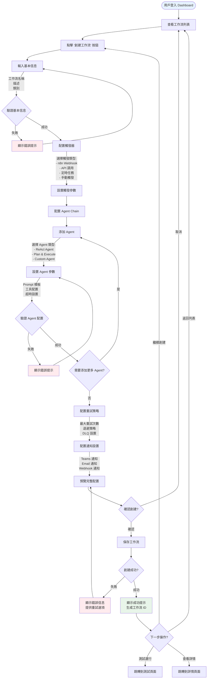
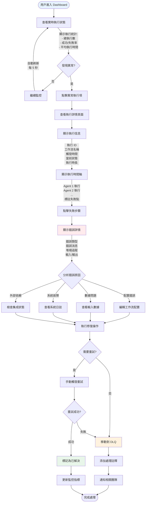

# UI/UX Design Specification
# IPA Platform - Intelligent Process Automation

**版本**: 1.0  
**日期**: 2025-11-19  
**狀態**: 草稿  
**負責人**: Design Team

---

## 📑 文檔導航

- **[UI/UX Design Specification](./ui-ux-design-spec.md)** ← 您在這裡
- [PRD 主文檔](../prd/prd-main.md)
- [設計系統規範](#design-system)
- [用戶流程圖](#user-flows)
- [頁面 Wireframes](#wireframes)
- [組件庫](#component-library)

---

## 📋 目錄

- [UI/UX Design Specification](#uiux-design-specification)
- [IPA Platform - Intelligent Process Automation](#ipa-platform---intelligent-process-automation)
  - [📑 文檔導航](#-文檔導航)
  - [📋 目錄](#-目錄)
  - [1. 設計原則](#1-設計原則)
    - [核心設計理念](#核心設計理念)
    - [設計目標](#設計目標)
  - [2. 設計系統](#2-設計系統)
    - [2.1 顏色系統](#21-顏色系統)
      - [主色調 (Primary Colors)](#主色調-primary-colors)
      - [中性色 (Neutral Colors)](#中性色-neutral-colors)
      - [語義色 (Semantic Colors)](#語義色-semantic-colors)
      - [狀態色 (Status Colors)](#狀態色-status-colors)
      - [顏色使用規範](#顏色使用規範)
    - [2.2 字體系統](#22-字體系統)
      - [字體家族](#字體家族)
      - [字體尺寸與行高](#字體尺寸與行高)
      - [字重 (Font Weight)](#字重-font-weight)
    - [2.3 間距系統](#23-間距系統)
      - [使用規範](#使用規範)
    - [2.4 陰影與深度](#24-陰影與深度)
    - [2.5 動畫規範](#25-動畫規範)
      - [動畫時長](#動畫時長)
      - [緩動函數 (Easing)](#緩動函數-easing)
      - [常用動畫](#常用動畫)
  - [3. 用戶流程圖](#3-用戶流程圖)
    - [3.1 工作流創建流程](#31-工作流創建流程)
    - [3.2 執行監控流程](#32-執行監控流程)
    - [3.3 Agent 配置流程](#33-agent-配置流程)
    - [3.4 問題排查流程](#34-問題排查流程)
  - [4. 頁面 Wireframes](#4-頁面-wireframes)
    - [4.1 Dashboard 主頁](#41-dashboard-主頁)
    - [4.2 工作流列表](#42-工作流列表)
    - [4.3 工作流編輯器](#43-工作流編輯器)
    - [4.4 執行詳情頁](#44-執行詳情頁)

---

## <a id="design-principles"></a>1. 設計原則

### 核心設計理念

**簡潔高效 (Simple & Efficient)**
- 減少認知負擔,讓專業用戶快速完成任務
- 避免過度裝飾,專注於功能性

**數據驅動 (Data-Driven)**
- 突出關鍵指標和狀態信息
- 使用可視化圖表輔助決策

**可預測 (Predictable)**
- 保持一致的交互模式
- 明確的操作反饋和錯誤提示

**可擴展 (Scalable)**
- 模塊化組件設計
- 支持主題定制和國際化

### 設計目標

| 目標 | 指標 | 當前基準 | 目標值 |
|------|------|----------|--------|
| **學習曲線** | 新用戶完成首次工作流創建時間 | 4 小時 | 30 分鐘 |
| **任務效率** | 完成常見操作的點擊次數 | 10+ 次 | ≤3 次 |
| **錯誤率** | 用戶操作錯誤率 | 15% | <5% |
| **滿意度** | NPS 得分 | N/A | ≥40 |

---

## <a id="design-system"></a>2. 設計系統

### <a id="color-system"></a>2.1 顏色系統

#### 主色調 (Primary Colors)

基於 Microsoft Fluent Design System,適配企業級應用:

**Primary Blue (品牌色)**
```css
--color-primary-50:  #E6F2FF;
--color-primary-100: #B3DBFF;
--color-primary-200: #80C4FF;
--color-primary-300: #4DADFF;
--color-primary-400: #1A96FF;
--color-primary-500: #0078D4;  /* 主要使用 */
--color-primary-600: #005BA1;
--color-primary-700: #004377;
--color-primary-800: #002D4E;
--color-primary-900: #001624;
```

**使用場景**:
- 主要操作按鈕
- 鏈接文字
- 選中狀態
- 進度指示

#### 中性色 (Neutral Colors)

```css
--color-neutral-0:   #FFFFFF;  /* 背景 */
--color-neutral-50:  #FAFAFA;  /* 次要背景 */
--color-neutral-100: #F5F5F5;  /* 卡片背景 */
--color-neutral-200: #E0E0E0;  /* 邊框 */
--color-neutral-300: #BDBDBD;  /* 分隔線 */
--color-neutral-400: #9E9E9E;  /* 禁用狀態 */
--color-neutral-500: #757575;  /* 輔助文字 */
--color-neutral-600: #616161;  /* 次要文字 */
--color-neutral-700: #424242;  /* 主要文字 */
--color-neutral-800: #303030;  /* 標題 */
--color-neutral-900: #212121;  /* 深色背景 */
```

#### 語義色 (Semantic Colors)

**Success (成功狀態)**
```css
--color-success-light: #E8F5E9;
--color-success-main:  #4CAF50;
--color-success-dark:  #2E7D32;
```

**Warning (警告狀態)**
```css
--color-warning-light: #FFF3E0;
--color-warning-main:  #FF9800;
--color-warning-dark:  #E65100;
```

**Error (錯誤狀態)**
```css
--color-error-light: #FFEBEE;
--color-error-main:  #F44336;
--color-error-dark:  #C62828;
```

**Info (信息提示)**
```css
--color-info-light: #E3F2FD;
--color-info-main:  #2196F3;
--color-info-dark:  #1565C0;
```

#### 狀態色 (Status Colors)

用於工作流執行狀態:

```css
--status-queued:    #9E9E9E;  /* 排隊中 - 灰色 */
--status-running:   #2196F3;  /* 執行中 - 藍色 */
--status-completed: #4CAF50;  /* 完成 - 綠色 */
--status-failed:    #F44336;  /* 失敗 - 紅色 */
--status-cancelled: #FF9800;  /* 取消 - 橙色 */
--status-dlq:       #9C27B0;  /* DLQ - 紫色 */
```

#### 顏色使用規範

| 元素類型 | 顏色變量 | 示例 |
|---------|---------|------|
| 主要按鈕 | `--color-primary-500` | 保存、創建、執行 |
| 次要按鈕 | `--color-neutral-200` + `--color-neutral-700` | 取消、返回 |
| 危險操作 | `--color-error-main` | 刪除、停止 |
| 頁面背景 | `--color-neutral-50` | 主背景 |
| 卡片背景 | `--color-neutral-0` | 內容卡片 |
| 主要文字 | `--color-neutral-700` | 正文內容 |
| 次要文字 | `--color-neutral-500` | 提示、標籤 |
| 邊框 | `--color-neutral-200` | 輸入框、卡片邊框 |

---

### <a id="typography"></a>2.2 字體系統

#### 字體家族

```css
--font-family-base: 'Segoe UI', -apple-system, BlinkMacSystemFont, 'Microsoft YaHei', sans-serif;
--font-family-mono: 'Cascadia Code', 'Consolas', 'Monaco', monospace;
```

**選擇理由**:
- **Segoe UI**: Microsoft 官方字體,Windows 原生支持
- **Microsoft YaHei**: 中文支持,清晰易讀
- **Cascadia Code**: 代碼顯示,支持連字符

#### 字體尺寸與行高

```css
/* 標題 */
--font-size-h1: 32px;  --line-height-h1: 40px;  /* 頁面主標題 */
--font-size-h2: 24px;  --line-height-h2: 32px;  /* 區塊標題 */
--font-size-h3: 20px;  --line-height-h3: 28px;  /* 子標題 */
--font-size-h4: 16px;  --line-height-h4: 24px;  /* 卡片標題 */

/* 正文 */
--font-size-base:   14px;  --line-height-base:   20px;  /* 主要文字 */
--font-size-small:  12px;  --line-height-small:  18px;  /* 輔助文字 */
--font-size-tiny:   10px;  --line-height-tiny:   14px;  /* 標籤、徽章 */

/* 代碼 */
--font-size-code:   13px;  --line-height-code:   20px;  /* 代碼塊 */
```

#### 字重 (Font Weight)

```css
--font-weight-light:   300;  /* 輕量文字 */
--font-weight-regular: 400;  /* 正常文字 */
--font-weight-medium:  500;  /* 次要強調 */
--font-weight-semibold:600;  /* 標題、按鈕 */
--font-weight-bold:    700;  /* 重要標題 */
```

---

### <a id="spacing"></a>2.3 間距系統

基於 8px 網格系統:

```css
--spacing-0:  0px;
--spacing-1:  4px;   /* 0.5 × base */
--spacing-2:  8px;   /* 1 × base */
--spacing-3:  12px;  /* 1.5 × base */
--spacing-4:  16px;  /* 2 × base */
--spacing-5:  20px;  /* 2.5 × base */
--spacing-6:  24px;  /* 3 × base */
--spacing-8:  32px;  /* 4 × base */
--spacing-10: 40px;  /* 5 × base */
--spacing-12: 48px;  /* 6 × base */
--spacing-16: 64px;  /* 8 × base */
--spacing-20: 80px;  /* 10 × base */
```

#### 使用規範

| 場景 | 間距值 | 示例 |
|------|--------|------|
| 組件內邊距 (小) | `--spacing-2` (8px) | 按鈕內邊距 |
| 組件內邊距 (中) | `--spacing-4` (16px) | 卡片內邊距 |
| 組件內邊距 (大) | `--spacing-6` (24px) | Modal 內邊距 |
| 元素間距 (緊湊) | `--spacing-2` (8px) | 表單字段間距 |
| 元素間距 (標準) | `--spacing-4` (16px) | 列表項間距 |
| 元素間距 (寬鬆) | `--spacing-6` (24px) | 區塊間距 |
| 區塊間距 | `--spacing-8` (32px) | 頁面區塊 |
| 頁面邊距 | `--spacing-6` (24px) | 頁面左右邊距 |

---

### <a id="shadows"></a>2.4 陰影與深度

使用 Material Design 陰影層級:

```css
/* 無陰影 */
--shadow-none: none;

/* 懸浮效果 (Hover) */
--shadow-sm: 0 1px 2px 0 rgba(0, 0, 0, 0.05);

/* 卡片、按鈕 */
--shadow-md: 0 4px 6px -1px rgba(0, 0, 0, 0.1),
             0 2px 4px -1px rgba(0, 0, 0, 0.06);

/* Modal、Dropdown */
--shadow-lg: 0 10px 15px -3px rgba(0, 0, 0, 0.1),
             0 4px 6px -2px rgba(0, 0, 0, 0.05);

/* Drawer、浮動面板 */
--shadow-xl: 0 20px 25px -5px rgba(0, 0, 0, 0.1),
             0 10px 10px -5px rgba(0, 0, 0, 0.04);

/* Modal 背景遮罩 */
--shadow-overlay: 0 0 0 9999px rgba(0, 0, 0, 0.5);
```

---

### <a id="animations"></a>2.5 動畫規範

#### 動畫時長

```css
--duration-instant: 100ms;  /* 即時反饋 */
--duration-fast:    200ms;  /* 快速動畫 */
--duration-base:    300ms;  /* 標準動畫 */
--duration-slow:    500ms;  /* 慢速動畫 */
```

#### 緩動函數 (Easing)

```css
--ease-in:     cubic-bezier(0.4, 0, 1, 1);      /* 加速 */
--ease-out:    cubic-bezier(0, 0, 0.2, 1);      /* 減速 */
--ease-in-out: cubic-bezier(0.4, 0, 0.2, 1);    /* 平滑 */
--ease-bounce: cubic-bezier(0.68, -0.55, 0.27, 1.55);  /* 彈跳 */
```

#### 常用動畫

**淡入淡出**
```css
.fade-enter {
  opacity: 0;
  transition: opacity var(--duration-fast) var(--ease-out);
}
.fade-enter-active {
  opacity: 1;
}
```

**滑入滑出**
```css
.slide-enter {
  transform: translateY(-10px);
  opacity: 0;
  transition: all var(--duration-base) var(--ease-out);
}
.slide-enter-active {
  transform: translateY(0);
  opacity: 1;
}
```

**懸浮效果**
```css
.hover-lift {
  transition: all var(--duration-fast) var(--ease-out);
}
.hover-lift:hover {
  transform: translateY(-2px);
  box-shadow: var(--shadow-md);
}
```

---

## <a id="user-flows"></a>3. 用戶流程圖

### <a id="flow-create-workflow"></a>3.1 工作流創建流程



**關鍵交互點**:
1. **實時驗證**: 每個配置步驟都有即時驗證反饋
2. **自動保存**: 每完成一個配置區塊自動保存草稿
3. **上下文幫助**: 關鍵配置項提供內聯幫助文檔
4. **模板支持**: 提供常用工作流模板快速創建

---

### <a id="flow-monitor-execution"></a>3.2 執行監控流程



**關鍵功能**:
1. **實時追蹤**: WebSocket 推送執行狀態更新
2. **快速定位**: 時間軸視圖快速定位失敗點
3. **智能分析**: 自動分類錯誤類型並提供建議
4. **一鍵重試**: 直接從詳情頁觸發重試

---

### <a id="flow-configure-agent"></a>3.3 Agent 配置流程



```mermaid
graph TD
    Start([進入 Agent 配置頁面]) --> ViewAgentList[查看現有 Agent 列表]
    ViewAgentList --> ChooseAction{選擇操作}
    
    ChooseAction --> |創建新 Agent| SelectType[選擇 Agent 類型]
    ChooseAction --> |編輯現有| LoadAgent[加載 Agent 配置]
    ChooseAction --> |克隆 Agent| CloneAgent[克隆並編輯]
    
    SelectType --> |ReAct Agent<br/>Plan & Execute<br/>Custom Agent| EnterBasic[輸入基本信息]
    CloneAgent --> EnterBasic
    LoadAgent --> EnterBasic
    
    EnterBasic --> |名稱<br/>描述<br/>標籤| ConfigPrompt[配置 Prompt 模板]
    
    ConfigPrompt --> SelectTemplate{使用模板?}
    SelectTemplate --> |是| ChooseTemplate[選擇 Prompt 模板]
    SelectTemplate --> |否| WritePrompt[手動編寫 Prompt]
    
    ChooseTemplate --> |從模板庫選擇<br/>支持變量替換| EditPrompt[編輯 Prompt]
    WritePrompt --> EditPrompt
    
    EditPrompt --> |支持 Markdown<br/>語法高亮<br/>變量提示| PreviewPrompt[預覽 Prompt]
    PreviewPrompt --> ValidatePrompt{驗證 Prompt}
    
    ValidatePrompt --> |失敗<br/>缺少必需變量| ShowPromptError[顯示驗證錯誤]
    ShowPromptError --> EditPrompt
    
    ValidatePrompt --> |成功| ConfigTools[配置工具集]
    ConfigTools --> AddTool[添加工具]
    
    AddTool --> |選擇工具類型:<br/>- API 調用<br/>- 數據庫查詢<br/>- 文件操作<br/>- 自定義函數| SetToolParams[設置工具參數]
    
    SetToolParams --> |API Endpoint<br/>認證方式<br/>請求參數<br/>響應映射| TestTool{測試工具?}
    
    TestTool --> |是| RunToolTest[執行工具測試]
    RunToolTest --> ShowTestResult[顯示測試結果]
    ShowTestResult --> TestSuccess{測試通過?}
    
    TestSuccess --> |失敗| DebugTool[調試工具配置]
    DebugTool --> SetToolParams
    
    TestSuccess --> |成功| MoreTools{添加更多工具?}
    TestTool --> |否| MoreTools
    
    MoreTools --> |是| AddTool
    MoreTools --> |否| ConfigAdvanced[配置高級選項]
    
    ConfigAdvanced --> |超時設置<br/>記憶體限制<br/>併發控制<br/>日誌級別| TestAgent[測試 Agent]
    
    TestAgent --> InputTestData[輸入測試數據]
    InputTestData --> RunAgentTest[執行 Agent 測試]
    RunAgentTest --> |顯示執行過程<br/>中間步驟<br/>最終結果| AgentTestResult{測試滿意?}
    
    AgentTestResult --> |否| DebugAgent[調試 Agent]
    DebugAgent --> |查看日誌<br/>檢查 Prompt<br/>調整工具| EditPrompt
    
    AgentTestResult --> |是| SaveAgent[保存 Agent]
    SaveAgent --> SaveSuccess{保存成功?}
    
    SaveSuccess --> |失敗| ShowSaveError[顯示錯誤]
    ShowSaveError --> SaveAgent
    
    SaveSuccess --> |成功| ShowSuccess[顯示成功提示]
    ShowSuccess --> NextAction{下一步?}
    
    NextAction --> |創建工作流| CreateWorkflow[跳轉到工作流創建]
    NextAction --> |繼續配置| ViewAgentList
    NextAction --> |返回| End([完成])
    
    style Start fill:#E6F2FF
    style ShowSuccess fill:#E8F5E9
    style ShowPromptError fill:#FFEBEE
    style ShowSaveError fill:#FFEBEE
    style ShowTestResult fill:#E3F2FD
```

**關鍵設計**:
1. **模板庫**: 提供常用 Prompt 模板,支持變量替換
2. **實時測試**: 配置過程中可隨時測試工具和 Agent
3. **版本控制**: 自動保存 Agent 配置版本歷史
4. **克隆功能**: 快速基於現有 Agent 創建新配置

---

### <a id="flow-troubleshoot"></a>3.4 問題排查流程



```mermaid
graph TD
    Start([收到故障告警]) --> NotifyReceived[接收通知]
    NotifyReceived --> |Teams 消息<br/>Email<br/>Dashboard 告警| OpenDashboard[打開監控儀表板]
    
    OpenDashboard --> CheckMetrics[檢查系統指標]
    CheckMetrics --> |CPU/內存使用率<br/>請求成功率<br/>平均響應時間<br/>錯誤率趨勢| IdentifyIssue{識別問題類型}
    
    IdentifyIssue --> |執行失敗| GotoExecution[跳轉到執行詳情]
    IdentifyIssue --> |性能下降| CheckPerformance[查看性能指標]
    IdentifyIssue --> |大量錯誤| CheckErrorLogs[查看錯誤日誌]
    IdentifyIssue --> |系統故障| CheckSystemHealth[檢查系統健康狀態]
    
    GotoExecution --> ViewFailedExec[查看失敗執行列表]
    ViewFailedExec --> |按時間排序<br/>過濾錯誤類型| ClickExec[點擊失敗項]
    ClickExec --> ViewExecDetail[查看執行詳情]
    
    ViewExecDetail --> AnalyzeError[分析錯誤信息]
    AnalyzeError --> |錯誤類型<br/>堆棧追蹤<br/>輸入輸出| DetermineRoot{確定根因}
    
    CheckPerformance --> ViewPerfGraph[查看性能圖表]
    ViewPerfGraph --> |響應時間趨勢<br/>吞吐量變化<br/>資源使用| IdentifyBottleneck[識別瓶頸]
    IdentifyBottleneck --> DetermineRoot
    
    CheckErrorLogs --> FilterLogs[過濾日誌]
    FilterLogs --> |時間範圍<br/>日誌級別<br/>關鍵字搜索| ViewLogDetail[查看日誌詳情]
    ViewLogDetail --> CorrelateEvents[關聯事件]
    CorrelateEvents --> DetermineRoot
    
    CheckSystemHealth --> ViewComponents[查看組件狀態]
    ViewComponents --> |API Gateway<br/>Redis Cache<br/>Database<br/>Message Queue| IdentifyFailed[識別故障組件]
    IdentifyFailed --> DetermineRoot
    
    DetermineRoot --> |配置錯誤| FixConfig[修復配置]
    DetermineRoot --> |代碼 Bug| CreateTicket[創建問題單]
    DetermineRoot --> |資源不足| ScaleResources[擴展資源]
    DetermineRoot --> |外部依賴| ContactVendor[聯繫供應商]
    DetermineRoot --> |數據問題| FixData[修復數據]
    
    FixConfig --> ApplyFix[應用修復]
    CreateTicket --> AssignDev[分配給開發團隊]
    ScaleResources --> ApplyFix
    ContactVendor --> WaitResponse[等待響應]
    FixData --> ApplyFix
    
    ApplyFix --> VerifyFix[驗證修復]
    AssignDev --> TrackProgress[追蹤進度]
    WaitResponse --> FollowUp[後續跟進]
    
    VerifyFix --> |運行測試<br/>檢查指標| FixSuccess{修復成功?}
    
    FixSuccess --> |否| DeepDive[深入調查]
    DeepDive --> |查看審計日誌<br/>追蹤請求鏈<br/>檢查依賴| DetermineRoot
    
    FixSuccess --> |是| RetryFailed[重試失敗執行]
    RetryFailed --> RetryResult{重試成功?}
    
    RetryResult --> |失敗| ReassessIssue[重新評估問題]
    ReassessIssue --> DetermineRoot
    
    RetryResult --> |成功| DocumentFix[記錄解決方案]
    DocumentFix --> |更新 Wiki<br/>添加註釋<br/>創建 Runbook| UpdateAlert[更新告警規則]
    
    UpdateAlert --> |優化閾值<br/>添加新指標| NotifyTeam[通知團隊]
    NotifyTeam --> |Teams 消息<br/>Email 總結| CloseIncident[關閉事件]
    
    CloseIncident --> PostMortem{需要復盤?}
    PostMortem --> |重大事件| ScheduleMeeting[安排復盤會議]
    PostMortem --> |常規問題| End([完成])
    
    ScheduleMeeting --> End
    
    style Start fill:#FFF3E0
    style CloseIncident fill:#E8F5E9
    style DeepDive fill:#E3F2FD
    style ReassessIssue fill:#FFEBEE
```

**工具支持**:

1. **智能搜索**: 跨日誌、執行記錄、審計追蹤的統一搜索
2. **關聯分析**: 自動關聯相關事件和指標
3. **根因建議**: 基於歷史數據的智能根因分析
4. **一鍵操作**: 常見修復操作一鍵執行(重啟、擴容等)

---

## <a id="wireframes"></a>4. 頁面 Wireframes

### <a id="page-dashboard"></a>4.1 Dashboard 主頁

```
┌────────────────────────────────────────────────────────────────────────────┐
│ IPA Platform                                   🔔 Notifications  👤 User   │
├────────────────────────────────────────────────────────────────────────────┤
│ ☰ Menu    Dashboard / Overview                      🔍 Search   ⚙ Settings│
├──────────────┬─────────────────────────────────────────────────────────────┤
│              │  📊 系統概覽                                Today 2025-11-19 │
│  📊 Dashboard│  ┌─────────────┬─────────────┬─────────────┬─────────────┐ │
│  ────────────│  │ Total Runs  │  Success    │   Failed    │   Running   │ │
│              │  │   1,247     │  1,156(93%) │   68(5%)    │    23(2%)   │ │
│  📝 Workflows│  │  ↑ 12% vs   │  ↑ 5% vs    │  ↓ 15% vs   │  ⟷ 0% vs    │ │
│              │  │  yesterday   │  yesterday  │  yesterday  │  yesterday  │ │
│  ⚙️ Agents   │  └─────────────┴─────────────┴─────────────┴─────────────┘ │
│              │                                                              │
│  📈 Monitoring│  📈 執行趨勢 (最近 24 小時)          [Hour|Day|Week|Month]  │
│              │  ┌──────────────────────────────────────────────────────┐   │
│  🔍 Audit Log│  │ 100 ▲                                                │   │
│              │  │  80 │    ▄█▄                        ▄█▄              │   │
│  🔔 Alerts   │  │  60 │   ▄███▄      ▄█▄            ▄████             │   │
│              │  │  40 │  ▄█████▄    ▄███▄    ▄█▄   ▄█████▄            │   │
│  ⚙️ Settings │  │  20 │ ▄███████▄  ▄█████▄  ▄███▄ ▄███████▄           │   │
│              │  │   0 └─────────────────────────────────────▶ Time     │   │
│              │  │       0  4  8  12 16 20 24 28 32 36 40 44 48         │   │
│              │  │  ■ Success  ■ Failed  ■ Running                      │   │
│              │  └──────────────────────────────────────────────────────┘   │
│              │                                                              │
│              │  🔥 最近執行                              [View All →]      │
│              │  ┌──────────────────────────────────────────────────────┐   │
│              │  │ Status  │ Workflow Name    │ Trigger    │ Duration  │   │
│              │  ├─────────┼──────────────────┼────────────┼───────────┤   │
│              │  │ ✅ Done │ Customer Onboard │ n8n Webhook│ 2m 34s    │   │
│              │  │ ⚠️ Fail │ Invoice Process  │ API Call   │ 1m 12s    │   │
│              │  │ 🔄 Run  │ Data Sync        │ Scheduled  │ 45s       │   │
│              │  │ ✅ Done │ Report Generate  │ Manual     │ 5m 23s    │   │
│              │  │ ✅ Done │ Email Notification│ n8n Webhook│ 15s       │   │
│              │  └──────────────────────────────────────────────────────┘   │
│              │                                                              │
│              │  ⚠️ 需要關注的問題                        [View All →]      │
│              │  ┌──────────────────────────────────────────────────────┐   │
│              │  │ 🔴 3 executions in DLQ - requires manual review      │   │
│              │  │ 🟡 Redis cache hit rate dropped to 65% (normal: 85%) │   │
│              │  │ 🟡 Average execution time increased by 25%           │   │
│              │  └──────────────────────────────────────────────────────┘   │
└──────────────┴─────────────────────────────────────────────────────────────┘
```

**關鍵元素**:

- **統計卡片**: 4 個關鍵指標(總執行、成功、失敗、運行中),帶趨勢對比
- **趨勢圖表**: 24 小時執行趨勢,可切換時間範圍
- **最近執行**: 最新 5 條執行記錄,狀態圖標醒目
- **問題提示**: 高亮需要關注的異常情況

---

### <a id="page-workflows"></a>4.2 工作流列表

```
┌────────────────────────────────────────────────────────────────────────────┐
│ IPA Platform                                   🔔 Notifications  👤 User   │
├────────────────────────────────────────────────────────────────────────────┤
│ ☰ Menu    Workflows / All                           🔍 Search   ⚙ Settings│
├──────────────┬─────────────────────────────────────────────────────────────┤
│              │  📝 工作流管理                              [+ Create New]   │
│  📊 Dashboard│                                                              │
│              │  🔍 [Search workflows...]        🏷️ [All Categories ▾]      │
│  📝 Workflows│     📊 [Status: All ▾]  🏷️ [Tags: All ▾]  📅 [Date ▾]    │
│  ────────────│                                                              │
│              │  ┌──────────────────────────────────────────────────────┐   │
│  ⚙️ Agents   │  │ ☑  Name           │Category │Status │Runs│Last Run │⚙│ │
│              │  ├──────────────────────────────────────────────────────┤   │
│  📈 Monitoring│  │ □  Customer      │Customer │🟢 Act│234 │2h ago   │⋮│ │
│              │  │    Onboarding    │Onboard  │      │    │         │ │ │
│  🔍 Audit Log│  │    n8n → 3 Agents│         │      │    │         │ │ │
│              │  ├──────────────────────────────────────────────────────┤   │
│  🔔 Alerts   │  │ □  Invoice       │Finance  │🟢 Act│189 │15m ago  │⋮│ │
│              │  │    Processing    │         │      │    │         │ │ │
│  ⚙️ Settings │  │    API → 2 Agents│         │      │    │         │ │ │
│              │  ├──────────────────────────────────────────────────────┤   │
│              │  │ □  Data Sync     │Data     │⏸ Pau│1.2K│1d ago   │⋮│ │
│              │  │    Daily ETL     │Pipeli ne│      │    │         │ │ │
│              │  │    Schedule →    │         │      │    │         │ │ │
│              │  │    5 Agents      │         │      │    │         │ │ │
│              │  ├──────────────────────────────────────────────────────┤   │
│              │  │ □  Report        │Reporting│🟢 Act│567 │3h ago   │⋮│ │
│              │  │    Generation    │         │      │    │         │ │ │
│              │  │    Manual → Agent│         │      │    │         │ │ │
│              │  ├──────────────────────────────────────────────────────┤   │
│              │  │ □  Email         │Notifica │🔴 Err│45  │5m ago   │⋮│ │
│              │  │    Notification  │tion     │      │    │⚠️ Failed│ │ │
│              │  │    Webhook → 1   │         │      │    │         │ │ │
│              │  │    Agent         │         │      │    │         │ │ │
│              │  └──────────────────────────────────────────────────────┘   │
│              │                                                              │
│              │  Showing 1-5 of 47 workflows                                 │
│              │  [← Prev]  [1] [2] [3] ... [10]  [Next →]                   │
│              │                                                              │
│              │  批量操作: [⏸ Pause] [▶️ Resume] [🗑️ Delete] [📋 Export]   │
└──────────────┴─────────────────────────────────────────────────────────────┘
```

**交互功能**:

- **多重過濾**: 按類別、狀態、標籤、日期篩選
- **批量操作**: 選擇多個工作流執行批量操作
- **快速操作**: 每行末尾 ⋮ 菜單(編輯/複製/刪除/查看)
- **狀態指示**: 清晰的狀態圖標(Active/Paused/Error)
- **信息密度**: 顯示觸發方式和 Agent 數量

---

### <a id="page-workflow-editor"></a>4.3 工作流編輯器

```
┌────────────────────────────────────────────────────────────────────────────┐
│ IPA Platform                                   🔔 Notifications  👤 User   │
├────────────────────────────────────────────────────────────────────────────┤
│ ☰ Menu    Workflows / Edit / Customer Onboarding    🔍 Search  ⚙ Settings│
├────────────┬───────────────────────────────────────────────────────────────┤
│            │  [< Back]  Customer Onboarding  [💾 Save] [🧪 Test] [✅ Deploy]│
│ 📋 Basic   │  ┌───────────────────────────────────────────────────────┐   │
│ ──────────│  │ 📝 Basic Information                                  │   │
│            │  │                                                       │   │
│ 🎯 Trigger │  │ Name:     [Customer Onboarding                     ] │   │
│            │  │ Category: [Customer Onboard ▾]                       │   │
│ 🤖 Agents  │  │ Desc:     [Automate customer onboarding process    ] │   │
│            │  │           [including verification and setup        ] │   │
│ 🔁 Retry   │  │ Tags:     [customer] [onboarding] [automated] [+]   │   │
│            │  └───────────────────────────────────────────────────────┘   │
│ 🔔 Notify  │                                                              │
│            │  ┌───────────────────────────────────────────────────────┐   │
│ 📊 Preview │  │ 🎯 Trigger Configuration                              │   │
│            │  │                                                       │   │
│            │  │ Type:     ( ) Manual                                 │   │
│            │  │           (•) n8n Webhook                            │   │
│            │  │           ( ) API Call                               │   │
│            │  │           ( ) Scheduled                              │   │
│            │  │                                                       │   │
│            │  │ Webhook:  [https://n8n.example.com/webhook/...    ] │   │
│            │  │           [📋 Copy] [🔗 Test]                        │   │
│            │  │                                                       │   │
│            │  │ Auth:     [☑] Require HMAC signature                │   │
│            │  │ Secret:   [••••••••••••••••] [👁 Show] [🔄 Rotate] │   │
│            │  └───────────────────────────────────────────────────────┘   │
│            │                                                              │
│            │  ┌───────────────────────────────────────────────────────┐   │
│            │  │ 🤖 Agent Chain Configuration            [+ Add Agent] │   │
│            │  │                                                       │   │
│            │  │  ┌─────────────────────────────────────────────────┐ │   │
│            │  │  │ [1] Data Validation Agent          [↑][↓][✕][⋮]│ │   │
│            │  │  │ Type: ReAct Agent                               │ │   │
│            │  │  │ Prompt: validate_customer_data.yaml             │ │   │
│            │  │  │ Tools: [API] [Database] [Validator]             │ │   │
│            │  │  │ Timeout: 30s  │  Max Retries: 3                 │ │   │
│            │  │  └─────────────────────────────────────────────────┘ │   │
│            │  │                    ⬇                                 │   │
│            │  │  ┌─────────────────────────────────────────────────┐ │   │
│            │  │  │ [2] Account Creation Agent         [↑][↓][✕][⋮]│ │   │
│            │  │  │ Type: Plan & Execute                            │ │   │
│            │  │  │ Prompt: create_account.yaml                     │ │   │
│            │  │  │ Tools: [CRM API] [Email Service]                │ │   │
│            │  │  │ Timeout: 60s  │  Max Retries: 2                 │ │   │
│            │  │  └─────────────────────────────────────────────────┘ │   │
│            │  │                    ⬇                                 │   │
│            │  │  ┌─────────────────────────────────────────────────┐ │   │
│            │  │  │ [3] Welcome Email Agent            [↑][↓][✕][⋮]│ │   │
│            │  │  │ Type: Custom Agent                              │ │   │
│            │  │  │ Prompt: send_welcome_email.yaml                 │ │   │
│            │  │  │ Tools: [Email Template] [SMTP]                  │ │   │
│            │  │  │ Timeout: 15s  │  Max Retries: 3                 │ │   │
│            │  │  └─────────────────────────────────────────────────┘ │   │
│            │  └───────────────────────────────────────────────────────┘   │
└────────────┴───────────────────────────────────────────────────────────────┘
```

**編輯功能**:

- **分步配置**: 左側導航分步驟配置(Basic/Trigger/Agents/Retry/Notify)
- **可視化 Chain**: Agent 順序清晰展示,支持拖拽排序
- **即時操作**: 每個 Agent 卡片提供快速操作按鈕
- **測試功能**: 可測試觸發器連接和單個 Agent
- **自動保存**: 配置更改自動保存草稿

---

### <a id="page-execution-details"></a>4.4 執行詳情頁

```
┌────────────────────────────────────────────────────────────────────────────┐
│ IPA Platform                                   🔔 Notifications  👤 User   │
├────────────────────────────────────────────────────────────────────────────┤
│ ☰ Menu    Executions / exec_20251119_123456     🔍 Search   ⚙ Settings   │
├──────────────┬─────────────────────────────────────────────────────────────┤
│              │  [< Back to List]     Execution Details      [🔄 Retry]     │
│  📊 Dashboard│  ┌──────────────────────────────────────────────────────┐   │
│              │  │ Status: ⚠️ FAILED       Duration: 2m 34s            │   │
│  📝 Workflows│  │ Workflow: Customer Onboarding                       │   │
│              │  │ ID: exec_20251119_123456                            │   │
│  ⚙️ Agents   │  │ Triggered: 2025-11-19 12:34:56 via n8n Webhook     │   │
│              │  │ Failed at: Agent 2 - Account Creation (1m 45s)     │   │
│  📈 Monitoring│  └──────────────────────────────────────────────────────┘   │
│  ────────────│                                                              │
│              │  ⏱️ Execution Timeline                                       │
│  🔍 Audit Log│  ┌──────────────────────────────────────────────────────┐   │
│              │  │ 00:00 ────────● Start                               │   │
│  🔔 Alerts   │  │               │                                      │   │
│              │  │ 00:15 ────────● Agent 1: Data Validation            │   │
│  ⚙️ Settings │  │               │  Status: ✅ SUCCESS                 │   │
│              │  │               │  Duration: 15s                       │   │
│              │  │               │  [View Details ▾]                    │   │
│              │  │               │                                      │   │
│              │  │ 01:30 ────────● Agent 2: Account Creation           │   │
│              │  │               │  Status: ⚠️ FAILED                  │   │
│              │  │               │  Duration: 1m 15s                    │   │
│              │  │               │  Error: API timeout (503)            │   │
│              │  │               │  [View Details ▾]                    │   │
│              │  │               │  ┌─────────────────────────────────┐│   │
│              │  │               │  │ 📄 Error Details:                ││   │
│              │  │               │  │ Type: HTTP 503 Service Unavailable││  │
│              │  │               │  │ Message: CRM API timeout after 60s││  │
│              │  │               │  │ Endpoint: POST /api/v1/accounts ││   │
│              │  │               │  │                                  ││   │
│              │  │               │  │ 📥 Input Data:                   ││   │
│              │  │               │  │ {                                ││   │
│              │  │               │  │   "name": "John Doe",            ││   │
│              │  │               │  │   "email": "john@example.com",   ││   │
│              │  │               │  │   "company": "Acme Corp"         ││   │
│              │  │               │  │ }                                ││   │
│              │  │               │  │                                  ││   │
│              │  │               │  │ 🔄 Retry History:                ││   │
│              │  │               │  │ Attempt 1: Failed (30s)          ││   │
│              │  │               │  │ Attempt 2: Failed (45s)          ││   │
│              │  │               │  │ Attempt 3: Failed (60s - timeout)││  │
│              │  │               │  │                                  ││   │
│              │  │               │  │ Stack Trace:                     ││   │
│              │  │               │  │ [View Full Trace ▾]              ││   │
│              │  │               │  └─────────────────────────────────┘│   │
│              │  │               │                                      │   │
│              │  │ 02:34 ────────● Execution Stopped                   │   │
│              │  │                                                      │   │
│              │  └──────────────────────────────────────────────────────┘   │
│              │                                                              │
│              │  🎯 Actions                                                  │
│              │  [🔄 Retry from Failed Step] [🔄 Retry from Start]          │
│              │  [🗑️ Move to DLQ] [📝 Add Comment]                         │
└──────────────┴─────────────────────────────────────────────────────────────┘
```

**詳情展示**:

- **時間軸視圖**: 清晰展示執行流程和失敗點
- **錯誤詳情**: 展開顯示完整錯誤信息、輸入輸出、重試歷史
- **快速操作**: 一鍵重試、移動到 DLQ、添加註釋
- **上下文信息**: 完整的執行上下文和觸發信息

---
