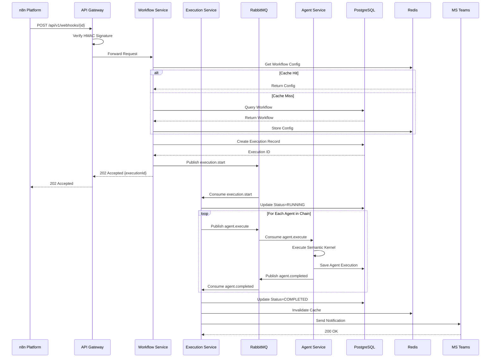

# Technical Architecture Design
# IPA Platform - Intelligent Process Automation

**版本**: 1.0  
**日期**: 2025-11-19  
**狀態**: 草稿  
**負責人**: Architecture Team

---

## 📑 文檔導航

- **[Technical Architecture](./technical-architecture.md)** ← 您在這裡
- [PRD 文檔](../01-planning/prd/prd-main.md)
- [UI/UX 設計](../01-planning/ui-ux/ui-ux-design-spec.md)
- [系統架構圖](#system-architecture)
- [核心模塊設計](#core-modules)
- [數據架構](#data-architecture)

---

## 📋 目錄

1. [架構概覽](#architecture-overview)
2. [設計原則](#design-principles)
3. [技術棧選擇](#technology-stack)
4. [系統架構](#system-architecture)
5. [核心模塊設計](#core-modules)
6. [數據架構設計](#data-architecture)
7. [集成架構](#integration-architecture)
8. [安全架構](#security-architecture)
9. [監控與日誌](#monitoring-logging)
10. [部署架構](#deployment-architecture)
11. [性能優化策略](#performance-optimization)
12. [災難恢復](#disaster-recovery)

---

## <a id="architecture-overview"></a>1. 架構概覽

### 1.1 系統定位

IPA Platform 是一個基於 **事件驅動** 和 **微服務架構** 的智能流程自動化平台,專注於:

- **靈活編排**: 通過 n8n 觸發和 Semantic Kernel Agent 執行複雜業務流程
- **智能決策**: 利用 AI Agent 處理非結構化數據和複雜邏輯
- **高可靠性**: 內置重試、DLQ、審計追蹤等企業級特性
- **可觀測性**: 全鏈路監控、日誌追蹤、性能分析

### 1.2 架構視圖

```
┌─────────────────────────────────────────────────────────────────┐
│                         Client Layer                            │
│  ┌───────────────┐  ┌───────────────┐  ┌───────────────┐      │
│  │  Web UI       │  │  Mobile App   │  │  CLI Tool     │      │
│  │  (React+TS)   │  │  (Optional)   │  │  (Optional)   │      │
│  └───────┬───────┘  └───────┬───────┘  └───────┬───────┘      │
└──────────┼──────────────────┼──────────────────┼───────────────┘
           │                  │                  │
           ▼                  ▼                  ▼
┌─────────────────────────────────────────────────────────────────┐
│                      API Gateway Layer                          │
│  ┌──────────────────────────────────────────────────────────┐  │
│  │  Nginx / Kong API Gateway                                │  │
│  │  - Authentication & Authorization                        │  │
│  │  - Rate Limiting & Throttling                           │  │
│  │  - Request Routing & Load Balancing                     │  │
│  └──────────────────────────────────────────────────────────┘  │
└──────────┬──────────────────────────────────────────────────────┘
           │
           ▼
┌─────────────────────────────────────────────────────────────────┐
│                     Application Layer                           │
│  ┌─────────────┐  ┌─────────────┐  ┌─────────────┐            │
│  │  Workflow   │  │  Execution  │  │  Agent      │            │
│  │  Service    │  │  Service    │  │  Service    │            │
│  │  (Node.js)  │  │  (C#/.NET)  │  │  (C#/.NET)  │            │
│  └──────┬──────┘  └──────┬──────┘  └──────┬──────┘            │
│         │                │                │                     │
│  ┌──────┴────────────────┴────────────────┴──────┐            │
│  │         Message Queue (RabbitMQ)               │            │
│  └────────────────────────────────────────────────┘            │
└──────────┬──────────────────────────────────────────────────────┘
           │
           ▼
┌─────────────────────────────────────────────────────────────────┐
│                       Data Layer                                │
│  ┌─────────────┐  ┌─────────────┐  ┌─────────────┐            │
│  │  PostgreSQL │  │  Redis      │  │  S3/Blob    │            │
│  │  (Primary)  │  │  (Cache)    │  │  (Storage)  │            │
│  └─────────────┘  └─────────────┘  └─────────────┘            │
└─────────────────────────────────────────────────────────────────┘
           │
           ▼
┌─────────────────────────────────────────────────────────────────┐
│                   External Integration Layer                    │
│  ┌─────────────┐  ┌─────────────┐  ┌─────────────┐            │
│  │  n8n        │  │  MS Teams   │  │  External   │            │
│  │  Platform   │  │  Webhooks   │  │  APIs       │            │
│  └─────────────┘  └─────────────┘  └─────────────┘            │
└─────────────────────────────────────────────────────────────────┘
```

### 1.3 關鍵特性映射

| 特性需求 | 架構實現 |
|---------|---------|
| **n8n 觸發** | API Gateway 接收 n8n webhook → 路由到 Execution Service |
| **Agent 執行** | Semantic Kernel Agent Runtime + Tool Integration |
| **重試機制** | Execution Service 內置指數退避重試 + DLQ |
| **審計追蹤** | PostgreSQL append-only audit log + SHA-256 簽名 |
| **實時監控** | Prometheus + Grafana + WebSocket 推送 |
| **緩存優化** | Redis multi-layer caching (workflow/execution/result) |
| **高可用性** | Kubernetes deployment + Health checks + Auto-scaling |

---

## <a id="design-principles"></a>2. 設計原則

### 2.1 架構原則

#### SOLID 原則

**Single Responsibility (單一職責)**
- 每個服務專注於單一業務領域
- Workflow Service: 工作流管理
- Execution Service: 執行調度
- Agent Service: Agent 運行時

**Open/Closed (開放封閉)**
- 通過插件機制擴展 Agent 能力
- 自定義 Tool Integration
- 可插拔的存儲後端

**Liskov Substitution (里氏替換)**
- 統一的 Agent 接口(IAgent)
- 可替換的 Tool 實現(ITool)

**Interface Segregation (接口隔離)**
- 細粒度的服務接口
- GraphQL Schema 分層設計

**Dependency Inversion (依賴倒置)**
- 依賴抽象接口而非具體實現
- Dependency Injection 容器

#### 12-Factor App

1. **Codebase**: Git monorepo with clear module boundaries
2. **Dependencies**: Package.json / .csproj explicit dependencies
3. **Config**: Environment variables for all configurations
4. **Backing Services**: Treat DB/Cache/Queue as attached resources
5. **Build, Release, Run**: CI/CD pipeline separation
6. **Processes**: Stateless services (state in Redis/DB)
7. **Port Binding**: Services export HTTP/gRPC endpoints
8. **Concurrency**: Horizontal scaling via Kubernetes
9. **Disposability**: Fast startup, graceful shutdown
10. **Dev/Prod Parity**: Docker ensures environment consistency
11. **Logs**: Structured logging to stdout (collected by FluentBit)
12. **Admin Processes**: Separate CLI tools for admin tasks

### 2.2 質量屬性

| 質量屬性 | 目標值 | 實現策略 |
|---------|-------|---------|
| **可用性** | 99.9% (月停機 < 43 分鐘) | 多副本部署 + 健康檢查 + 自動故障轉移 |
| **性能** | API P95 < 500ms | Redis 緩存 + 數據庫索引 + 異步處理 |
| **可擴展性** | 支持 1000+ 並發執行 | Kubernetes HPA + Message Queue |
| **可維護性** | 新功能開發 < 2 週 | 模塊化設計 + 清晰文檔 + 自動化測試 |
| **安全性** | OWASP Top 10 防護 | OAuth 2.0 + HTTPS + 輸入驗證 + 審計日誌 |
| **可觀測性** | 全鏈路追蹤覆蓋率 100% | OpenTelemetry + Distributed Tracing |

---

## <a id="technology-stack"></a>3. 技術棧選擇

### 3.1 後端技術

#### 編程語言與框架

**Node.js + TypeScript**
- **用途**: API Gateway, Workflow Service
- **選擇理由**: 
  - 與 n8n 生態兼容性好
  - 非同步 I/O 適合高並發場景
  - TypeScript 提供類型安全
- **框架**: Express.js / Fastify
- **版本**: Node.js 20 LTS, TypeScript 5.x

**C# + .NET 8**
- **用途**: Execution Service, Agent Service
- **選擇理由**:
  - Semantic Kernel 原生支持
  - 強類型系統,適合複雜業務邏輯
  - 優秀的異步編程模型(async/await)
  - 高性能,低延遲
- **框架**: ASP.NET Core 8, Semantic Kernel SDK
- **版本**: .NET 8 LTS

#### API 設計

**REST API**
- **標準**: OpenAPI 3.0 規範
- **認證**: OAuth 2.0 + JWT
- **版本控制**: URL path versioning (`/api/v1/`)

**GraphQL API**
- **框架**: Apollo Server (Node.js), HotChocolate (.NET)
- **用途**: 複雜查詢、前端靈活數據獲取
- **訂閱**: GraphQL Subscriptions (WebSocket)

**gRPC**
- **用途**: 內部服務間通信(高性能)
- **Protocol**: Protocol Buffers 3

### 3.2 數據存儲

#### 主數據庫: PostgreSQL 15

**選擇理由**:
- ACID 事務保證數據一致性
- JSON/JSONB 支持半結構化數據
- 強大的索引能力(B-Tree, GIN, BRIN)
- 成熟的複製和備份方案

**Schema 設計**:
```sql
-- Workflows 表
CREATE TABLE workflows (
  id UUID PRIMARY KEY DEFAULT gen_random_uuid(),
  name VARCHAR(255) NOT NULL,
  description TEXT,
  category VARCHAR(100),
  trigger_config JSONB NOT NULL,
  agent_chain JSONB NOT NULL,
  retry_config JSONB,
  notification_config JSONB,
  status VARCHAR(50) DEFAULT 'active',
  created_at TIMESTAMPTZ DEFAULT NOW(),
  updated_at TIMESTAMPTZ DEFAULT NOW(),
  created_by UUID REFERENCES users(id),
  version INTEGER DEFAULT 1
);

-- Executions 表
CREATE TABLE executions (
  id UUID PRIMARY KEY DEFAULT gen_random_uuid(),
  workflow_id UUID REFERENCES workflows(id),
  status VARCHAR(50) NOT NULL,
  triggered_by VARCHAR(100),
  triggered_at TIMESTAMPTZ DEFAULT NOW(),
  started_at TIMESTAMPTZ,
  completed_at TIMESTAMPTZ,
  duration_ms INTEGER,
  input_data JSONB,
  output_data JSONB,
  error_details JSONB,
  retry_count INTEGER DEFAULT 0,
  parent_execution_id UUID REFERENCES executions(id)
);

-- Agent Executions 表
CREATE TABLE agent_executions (
  id UUID PRIMARY KEY DEFAULT gen_random_uuid(),
  execution_id UUID REFERENCES executions(id),
  agent_id UUID REFERENCES agents(id),
  sequence_order INTEGER NOT NULL,
  status VARCHAR(50) NOT NULL,
  started_at TIMESTAMPTZ,
  completed_at TIMESTAMPTZ,
  duration_ms INTEGER,
  input_data JSONB,
  output_data JSONB,
  error_details JSONB,
  tokens_used INTEGER,
  cost_usd DECIMAL(10,6)
);

-- Audit Log 表 (append-only)
CREATE TABLE audit_logs (
  id BIGSERIAL PRIMARY KEY,
  timestamp TIMESTAMPTZ DEFAULT NOW(),
  user_id UUID REFERENCES users(id),
  action VARCHAR(100) NOT NULL,
  resource_type VARCHAR(100) NOT NULL,
  resource_id UUID,
  details JSONB,
  ip_address INET,
  user_agent TEXT,
  signature VARCHAR(64) NOT NULL -- SHA-256
);

-- 索引
CREATE INDEX idx_workflows_status ON workflows(status);
CREATE INDEX idx_workflows_created_at ON workflows(created_at DESC);
CREATE INDEX idx_executions_workflow_id ON executions(workflow_id);
CREATE INDEX idx_executions_status ON executions(status);
CREATE INDEX idx_executions_triggered_at ON executions(triggered_at DESC);
CREATE INDEX idx_agent_executions_execution_id ON agent_executions(execution_id);
CREATE INDEX idx_audit_logs_timestamp ON audit_logs(timestamp DESC);
CREATE INDEX idx_audit_logs_user_id ON audit_logs(user_id);
CREATE INDEX idx_audit_logs_resource ON audit_logs(resource_type, resource_id);
```

#### 緩存: Redis 7

**緩存層級**:

```
L1: Workflow Configuration Cache
  - Key: workflow:{id}
  - TTL: 1 hour
  - Invalidation: On workflow update

L2: Execution Status Cache
  - Key: execution:{id}:status
  - TTL: 5 minutes
  - Invalidation: On status change

L3: Agent Result Cache
  - Key: agent:{agent_id}:result:{input_hash}
  - TTL: 24 hours
  - Use Case: 相同輸入避免重複執行

L4: API Response Cache
  - Key: api:v1:{endpoint}:{query_hash}
  - TTL: 1 minute
  - Use Case: 高頻查詢接口
```

**數據結構使用**:

- **String**: 簡單 key-value 緩存
- **Hash**: Workflow/Execution 對象緩存
- **List**: 執行隊列
- **Sorted Set**: 優先級隊列,延遲任務
- **Pub/Sub**: 實時通知推送
- **Stream**: 事件溯源日誌

#### 對象存儲: S3 / Azure Blob

**存儲內容**:
- 大型執行結果(> 1MB)
- 文件類型的 Agent 輸出
- 審計日誌歸檔(> 90 天)
- 備份文件

**命名規範**:
```
executions/{year}/{month}/{day}/{execution_id}/output.json
audit-logs/archive/{year}/{month}/logs.tar.gz
backups/{timestamp}/postgresql-dump.sql.gz
```

### 3.3 消息隊列

#### RabbitMQ 3.12

**選擇理由**:
- 支持多種消息模式(Direct, Topic, Fanout)
- 消息持久化和確認機制
- 死信隊列(DLQ)原生支持
- 管理界面友好

**隊列設計**:

```
Exchange: ipa.executions.topic (Type: Topic)
├── Queue: executions.pending
│   ├── Binding: execution.start
│   └── Consumer: Execution Service
├── Queue: executions.retry
│   ├── Binding: execution.retry
│   ├── TTL: Based on backoff strategy
│   └── Consumer: Execution Service
├── Queue: executions.dlq
│   ├── Binding: execution.dlq
│   └── Consumer: DLQ Handler Service
└── Queue: notifications.teams
    ├── Binding: notification.*
    └── Consumer: Notification Service

Exchange: ipa.agents.direct (Type: Direct)
├── Queue: agents.react
├── Queue: agents.plan-execute
└── Queue: agents.custom
```

**消息格式**:
```json
{
  "messageId": "uuid",
  "timestamp": "2025-11-19T12:34:56Z",
  "type": "execution.start",
  "payload": {
    "executionId": "uuid",
    "workflowId": "uuid",
    "inputData": {}
  },
  "metadata": {
    "correlationId": "trace-id",
    "retryCount": 0,
    "priority": 1
  }
}
```

### 3.4 前端技術

#### React 18 + TypeScript

**狀態管理**: Zustand (輕量級) or Redux Toolkit
**路由**: React Router v6
**UI 組件**: 
- Ant Design 5 (企業級 UI 庫)
- TailwindCSS (utility-first CSS)
**圖表**: ECharts / Recharts
**表單**: React Hook Form + Zod validation
**HTTP 客戶端**: Axios / TanStack Query (React Query)
**WebSocket**: Socket.io-client
**構建工具**: Vite 5

#### 代碼組織

```
src/
├── components/           # 可復用組件
│   ├── Button/
│   ├── Input/
│   ├── Card/
│   └── ...
├── features/             # 功能模塊
│   ├── workflows/
│   │   ├── components/
│   │   ├── hooks/
│   │   ├── api/
│   │   └── types/
│   ├── executions/
│   └── agents/
├── layouts/              # 頁面佈局
├── pages/                # 路由頁面
├── services/             # API 服務
├── stores/               # 狀態管理
├── utils/                # 工具函數
└── types/                # TypeScript 類型
```

### 3.5 DevOps 技術

#### 容器化: Docker + Kubernetes

**Docker Images**:
- `ipa-api-gateway`: Nginx + Node.js
- `ipa-workflow-service`: Node.js 20
- `ipa-execution-service`: .NET 8
- `ipa-agent-service`: .NET 8 + Semantic Kernel
- `ipa-web-ui`: Nginx + React static files

**Kubernetes Resources**:
- Deployment: 服務部署
- Service: 內部服務發現
- Ingress: 外部流量路由
- ConfigMap: 配置管理
- Secret: 敏感信息
- HPA: 自動擴展
- PVC: 持久化存儲

#### CI/CD: GitHub Actions

**Pipeline 階段**:
1. **Build**: Docker image build
2. **Test**: Unit tests, Integration tests
3. **Scan**: Security vulnerability scan (Trivy)
4. **Deploy**: Kubernetes deployment
5. **Smoke Test**: 基本功能驗證

#### 監控與日誌

**Prometheus + Grafana**:
- 服務指標收集
- 自定義 Dashboard
- 告警規則配置

**ELK Stack (Elasticsearch + Logstash + Kibana)**:
- 集中式日誌管理
- 日誌搜索和分析
- 可視化儀表板

**Jaeger / Zipkin**:
- 分布式追蹤
- 請求鏈路分析
- 性能瓶頸識別

**Sentry**:
- 錯誤追蹤
- 異常報警
- 用戶影響分析

---

## <a id="system-architecture"></a>4. 系統架構

### 4.1 分層架構

```
┌─────────────────────────────────────────────────────────────────┐
│                      Presentation Layer                         │
│  - Web UI (React)                                               │
│  - API Documentation (Swagger/GraphQL Playground)               │
└───────────────────────────────┬─────────────────────────────────┘
                                │
┌───────────────────────────────┴─────────────────────────────────┐
│                      Application Layer                          │
│  ┌───────────────────────────────────────────────────────────┐ │
│  │  API Gateway (Kong / Nginx)                               │ │
│  │  - Rate Limiting                                          │ │
│  │  - Authentication & Authorization                         │ │
│  │  - Request Routing                                        │ │
│  └───────────────────────────────────────────────────────────┘ │
│                                                                  │
│  ┌─────────────────┐  ┌─────────────────┐  ┌────────────────┐ │
│  │  Workflow       │  │  Execution      │  │  Agent         │ │
│  │  Service        │  │  Service        │  │  Service       │ │
│  │                 │  │                 │  │                │ │
│  │  - CRUD Ops     │  │  - Scheduling   │  │  - SK Runtime  │ │
│  │  - Validation   │  │  - Retry Logic  │  │  - Tool Mgmt   │ │
│  │  - Versioning   │  │  - DLQ Handler  │  │  - Prompt Exec │ │
│  └─────────────────┘  └─────────────────┘  └────────────────┘ │
└───────────────────────────────┬─────────────────────────────────┘
                                │
┌───────────────────────────────┴─────────────────────────────────┐
│                      Domain Layer                               │
│  ┌─────────────────┐  ┌─────────────────┐  ┌────────────────┐ │
│  │  Workflow       │  │  Execution      │  │  Agent         │ │
│  │  Domain         │  │  Domain         │  │  Domain        │ │
│  │                 │  │                 │  │                │ │
│  │  - Entities     │  │  - Entities     │  │  - Entities    │ │
│  │  - Aggregates   │  │  - Value Objs   │  │  - Interfaces  │ │
│  │  - Domain Rules │  │  - State Machine│  │  - Strategies  │ │
│  └─────────────────┘  └─────────────────┘  └────────────────┘ │
└───────────────────────────────┬─────────────────────────────────┘
                                │
┌───────────────────────────────┴─────────────────────────────────┐
│                   Infrastructure Layer                          │
│  ┌─────────────────┐  ┌─────────────────┐  ┌────────────────┐ │
│  │  PostgreSQL     │  │  Redis          │  │  RabbitMQ      │ │
│  │  Repository     │  │  Cache          │  │  Queue         │ │
│  └─────────────────┘  └─────────────────┘  └────────────────┘ │
│                                                                  │
│  ┌─────────────────┐  ┌─────────────────┐  ┌────────────────┐ │
│  │  External APIs  │  │  n8n Platform   │  │  MS Teams      │ │
│  │  Integration    │  │  Integration    │  │  Webhooks      │ │
│  └─────────────────┘  └─────────────────┘  └────────────────┘ │
└─────────────────────────────────────────────────────────────────┘
```

### 4.2 執行流程架構



---

**待續**: 下一部分將包含核心模塊詳細設計、數據架構、集成架構等內容。

**文檔狀態**: 第 1 部分完成 (架構概覽、設計原則、技術棧、系統架構) ✅
